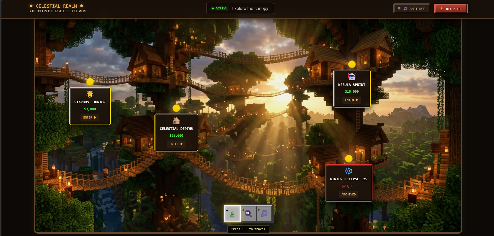
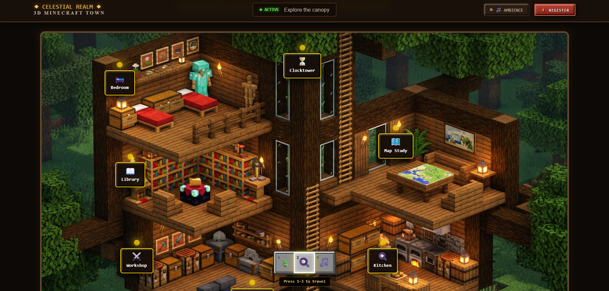

# Hackathon landing pg

## Overview
This project is designed like a "Minecraft‑themed village". Each house on the overworld map represents a hackathon ,either upcoming or past.  
When you click a house, you enter its "interior view", where different rooms store hackathon details such as prize pool, judges, schedule, and resources.  

## Features
- **Minecraft village**: Houses act as markers for hackathons.  
- **Interior of each house**: Rooms like library, bedroom, and storage display hackathon information.   
- **Interactive UI**: Clickable hotspots and glowing markers.  
- **Deployment**: Hosted live via GitHub Pages.

## Technologies
- HTML  
- CSS  
- JavaScript  

## Setup Instructions
To run the project locally:
```bash
git clone https://github.com/SiyaJain01/Hackathon-landing-pg.git
cd Hackathon-landing-pg
open index.html
```
##Project structure
Asset
  ├── village_map_landscape.png   # Overworld map background
  ├── house_cutaway_realistic.png # Interior cutaway image
index.html
hackathon.css
hackathon.js

## 📸 Screenshots

### Overworld Map


### Interior Cutaway


## 🚀 Deployment
Live demo available at:  
[Hackathon Landing Page](https://SiyaJain01.github.io/Hackathon-landing-pg/)


